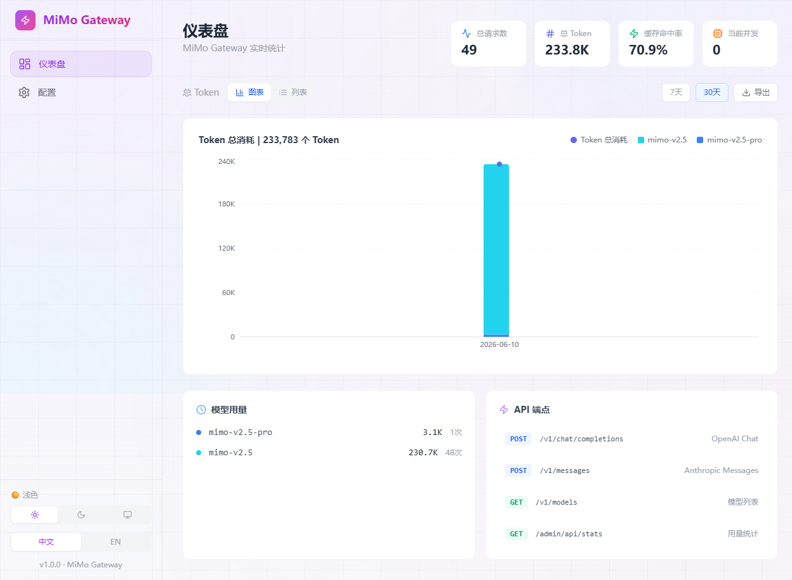
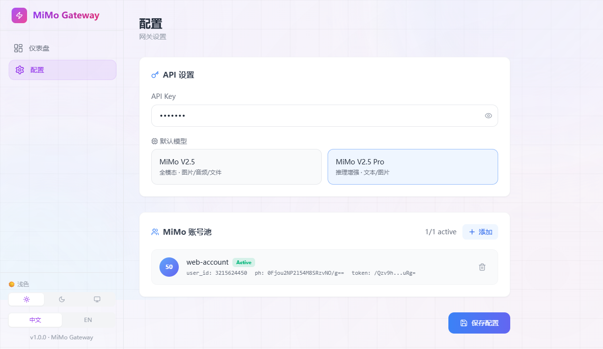

<div align="center">

# ⚡ MiMo Free API

**将小米 MiMo 网页端反向代理为 OpenAI / Anthropic 兼容 API**

[English](#english) · [中文](#中文) · [特性](#特性) · [快速开始](#快速开始) · [截图](#截图)


</div>

---

## 中文

### 这是什么？

MiMo Free API 是一个高性能反向代理网关，将小米 MiMo AI 网页端（aistudio.xiaomimimo.com）转换为标准 OpenAI 和 Anthropic 兼容 API。你可以用它在任何支持 OpenAI API 的客户端、Agent 框架中免费使用 MiMo 大模型。

### 为什么需要它？

- MiMo 网页端免费但没有提供 API
- MiMo 官方 API（Token Plan）有调用限制
- 本项目可以让你用网页端的免费额度，通过标准 API 格式接入任何工具，包括但不限于 Hermes Agent、OpenClaw、Claude Code、Codex、OpenCode、GitHub Copilot、Trae、Qoder、WorkBuddy、MiClaw、酒馆等

### 特性

- 🔧 **工具调用（Tool Calling）** — 支持 OpenAI / Anthropic 双格式工具调用，自动注入工具提示、解析 DSML/XML 工具输出、长上下文智能裁剪
- 🔥 **OpenAI + Anthropic 双格式兼容** — `/v1/chat/completions` 和 `/v1/messages`
- 🧠 **深度思考支持** — 自动处理 MiMo 的 thinking 内容，可选择是否返回
- 🖼️ **多模态智能路由** — 检测图片/音频/文件自动选择 mimo-v2.5 或 mimo-v2.5-pro
- 👥 **多账号轮转** — 支持配置多个账号，自动轮转分担负载
- 📊 **实时统计仪表盘** — Token 用量、请求量、模型分布可视化
- 🌐 **中英双语 + 浅色/暗色主题** — 前端完全国际化
- ⚡ **单二进制部署** — Go 编译，前端内嵌，开箱即用

### 截图

**仪表盘** — 实时统计 Token 用量、请求量、模型分布



**配置管理** — API 设置、模型切换、账号池管理




### 快速开始

#### 方式一：下载预编译版本

从 [Releases](https://github.com/wtz44/mimo-free-api/releases) 下载对应平台的二进制文件，直接运行。

#### 方式二：源码编译

```bash
# 克隆仓库
git clone https://github.com/wtz44/mimo-free-api.git
cd mimo-free-api

# 编译前端
cd web
npm install
npm run build
cd ..

# 编译后端（Go 1.22+）
go build -o mimo-free-api.exe .
```

#### 启动

```bash
./mimo-free-api.exe
```

默认监听 `http://localhost:8080`，打开浏览器即可访问管理面板。

### 配置

首次运行会自动生成 `config.json`：

```json
{
  "port": "8080",
  "api_key": "sk-mimo",
  "default_model": "mimo-v2.5",
  "accounts": []
}
```

| 字段 | 说明 |
|------|------|
| `port` | 监听端口 |
| `api_key` | API 认证密钥（客户端连接时使用） |
| `default_model` | 默认模型：`mimo-v2.5`（全模态）或 `mimo-v2.5-pro`（推理增强） |
| `accounts` | MiMo 账号列表，支持多账号轮转 |

#### 添加账号

在 `config.json` 的 `accounts` 数组中添加：

```json
{
  "accounts": [
    {
      "id": "my-account",
      "service_token": "你的 serviceToken 值",
      "user_id": "你的 userId 值",
      "ph": "你的 xiaomichatbot_ph 值",
      "active": true
    }
  ]
}
```

也可以通过管理面板（打开 `http://localhost:8080`）在"配置"页面的"添加账号"表单中添加。

### 🍪 获取 MiMo 账号 Cookie 详细攻略

#### 第一步：登录 MiMo AI Studio

1. 打开浏览器，访问 **https://aistudio.xiaomimimo.com**
2. 使用小米账号登录（手机号/邮箱/小米 ID 均可）
3. 登录成功后，在对话框随便发一条消息，确认能正常对话

#### 第二步：打开开发者工具

1. 按 **F12**（或 `Ctrl+Shift+I` / `Cmd+Option+I`）打开浏览器开发者工具
2. 切换到 **Network（网络）** 面板
3. 勾选左上角的 **Preserve log（保留日志）**，防止页面跳转时记录被清空

#### 第三步：触发一个请求

1. 在 MiMo 对话框中发送任意消息（如 "你好"）
2. 在 Network 面板的请求列表中，找到 `chat` 开头的请求（通常是 `chat?appId=...`）
3. 点击该请求

#### 第四步：复制 Cookie 信息

点击请求后，在右侧面板中找到 **Request Headers（请求头）**，从中提取以下三个值：

**方法 A：从 Cookie 行提取**

在 Request Headers 中找到 `cookie:` 字段，它是一个长字符串，形如：

```
serviceToken=xxx; userId=123456; xiaomichatbot_ph=yyy; ...
```

从中提取：

| 你需要的字段 | Cookie 中的 key | 示例格式 |
|---|---|---|
| `service_token` | `serviceToken` | `/Qzv9hyEQZi...`（很长的 base64 字符串） |
| `user_id` | `userId` | `3215624450`（纯数字） |
| `ph` | `xiaomichatbot_ph` | `0Fjou2NP2l54M8SRzvNO/g==`（base64 字符串） |

**方法 B：使用 cURL 导出（推荐）**

1. 右键点击 `chat` 请求 → **Copy（复制）** → **Copy as cURL**
2. 粘贴到文本编辑器，从 cURL 命令中找到 `--cookie` 或 `-H 'cookie:'` 部分
3. 提取上述三个字段

#### 第五步：填入配置

将提取的值填入 `config.json`：

```json
{
  "accounts": [
    {
      "id": "account-1",
      "service_token": "这里填 serviceToken 的完整值",
      "user_id": "这里填 userId",
      "ph": "这里填 xiaomichatbot_ph",
      "active": true
    }
  ]
}
```

> ⚠️ **注意事项：**
> - Cookie 有效期有限，过期后需要重新获取
> - **不要** 将 Cookie 分享给他人
> - 多个账号可以配置多组，网关会自动轮转
> - `ph` 值中如果包含 `=` 等特殊字符，直接保留原样即可

### 使用方法

#### OpenAI 格式

```bash
curl http://localhost:8080/v1/chat/completions \
  -H "Content-Type: application/json" \
  -H "Authorization: Bearer sk-mimo" \
  -d '{
    "model": "mimo-v2.5",
    "messages": [{"role": "user", "content": "你好"}],
    "stream": true
  }'
```

#### Anthropic 格式

```bash
curl http://localhost:8080/v1/messages \
  -H "Content-Type: application/json" \
  -H "x-api-key: sk-mimo" \
  -H "anthropic-version: 2023-06-01" \
  -d '{
    "model": "mimo-v2.5",
    "messages": [{"role": "user", "content": "你好"}],
    "max_tokens": 4096
  }'
```

#### 对话上下文

使用 `conv:` 前缀保持多轮对话：

```json
{
  "model": "mimo-v2.5",
  "messages": [
    {"role": "user", "content": "conv:my-chat: 记住数字 777"}
  ]
}
```

第二轮：

```json
{
  "model": "mimo-v2.5",
  "messages": [
    {"role": "user", "content": "conv:my-chat: 我让你记的数字是啥？"}
  ]
}
```

#### 在第三方客户端中使用

| 客户端 | Base URL | API Key | Model |
|--------|----------|---------|-------|
| ChatGPT-Next-Web / LobeChat / Open WebUI | `http://localhost:8080/v1` | `sk-mimo` | `mimo-v2.5` |
| ChatBox / TypingMind | `http://localhost:8080` | `sk-mimo` | `mimo-v2.5` |
| Claude Desktop (Anthropic) | `http://localhost:8080` | `sk-mimo` | `mimo-v2.5` |

#### 模型说明

| 模型 | 能力 | 适用场景 |
|------|------|---------|
| `mimo-v2.5` | 图片、音频、文件、文本 | 全模态通用场景 |
| `mimo-v2.5-pro` | 图片、文本（推理增强） | 需要深度推理的纯文本/图片任务 |

### 技术栈

- **后端**: Go + Chi Router（无状态架构）
- **前端**: React + TypeScript + Tailwind CSS + Framer Motion
- **数据持久化**: JSON 文件（统计）

### 项目结构

```
mimo-free-api/
├── main.go                    # 入口 + 路由注册
├── config.json                # 配置文件（自动生成）
├── data/                      # 持久化数据
│   ├── stats.json
│   └── conversations.json
├── internal/
│   ├── adapter/               # OpenAI / Anthropic 类型定义与转换
│   ├── config/                # 配置管理
│   ├── handler/               # HTTP 处理器
│   │   ├── chat.go            # OpenAI + Anthropic 兼容接口（无状态）
│   │   └── admin.go           # 管理接口
│   ├── mimo/                  # MiMo 网页端 HTTP 客户端
│   ├── pool/                  # 账号轮转池
│   ├── prompt/                # Prompt 组装（DeepSeek 特殊 token 格式）
│   ├── promptcompat/          # 消息规范化 + 工具注入 + 上下文裁剪
│   ├── router/                # 模型路由
│   ├── stats/                 # 统计追踪
│   └── toolcall/              # 工具调用提示词 + 7 层优先级解析器
├── web/                       # React 前端源码
│   ├── src/
│   │   ├── components/
│   │   │   ├── Dashboard.tsx  # 统计仪表盘
│   │   │   ├── ConfigPanel.tsx # 配置管理
│   │   │   └── Sidebar.tsx    # 侧边栏导航
│   │   └── contexts/          # 主题/语言上下文
│   └── index.html
└── browser-extension/         # Cookie 获取辅助扩展（可选）
```

### 常见问题

**Q: Cookie 多久过期？**
A: 通常数天到数周不等，取决于小米的策略。如果请求返回认证错误，需要重新获取 Cookie。

**Q: 可以同时使用多个账号吗？**
A: 可以，在 `config.json` 的 `accounts` 数组中配置多个账号，网关会自动轮转。

**Q: 支持图片/文件上传吗？**
A: 支持，使用 `mimo-v2.5` 模型时支持图片、音频和文件。以 base64 格式在 content 中传递。

**Q: 和 Token Plan API 有什么区别？**
A: Token Plan 是小米官方 API，有调用限制。本项目直接使用网页端，走的是网页端的免费额度。

### License

MIT

---

## English

### What is this?

MiMo Free API is a high-performance reverse proxy gateway that converts Xiaomi MiMo AI web interface (aistudio.xiaomimimo.com) into standard OpenAI and Anthropic compatible APIs. Use it to access MiMo models for free through any OpenAI-compatible client or agent framework.

### Why?

- MiMo web UI is free but doesn't provide an API
- MiMo official API (Token Plan) has usage limits
- This project lets you use the web UI's free quota through standard API formats, compatible with tools including but not limited to Hermes Agent, OpenClaw, Claude Code, Codex, OpenCode, GitHub Copilot, Trae, Qoder, WorkBuddy, MiClaw, SillyTavern, and more

### Features

- 🔧 **Tool Calling** — OpenAI / Anthropic dual-format tool calling, auto-inject tool prompts, parse DSML/XML tool output, long-context smart trimming
- 🔥 **OpenAI + Anthropic compatible** — `/v1/chat/completions` and `/v1/messages`
- 🧠 **Deep thinking support** — Handles MiMo's thinking content automatically
- 🖼️ **Multi-modal routing** — Auto-selects mimo-v2.5 or mimo-v2.5-pro based on content type
- 👥 **Multi-account rotation** — Configure multiple accounts for load distribution
- 📊 **Real-time dashboard** — Token usage, request volume, model distribution visualization
- 🌐 **i18n + themes** — Chinese/English, light/dark/system themes
- ⚡ **Single binary** — Go compiled, frontend embedded, zero dependencies

### Quick Start

```bash
# Clone
git clone https://github.com/wtz44/mimo-free-api.git
cd mimo-free-api

# Build frontend
cd web && npm install && npm run build && cd ..

# Build backend (Go 1.22+ required)
go build -o mimo-free-api .

# Run
./mimo-free-api
```

Open `http://localhost:8080` for the management dashboard.

### Getting MiMo Cookies

1. Visit **https://aistudio.xiaomimimo.com** and log in with your Xiaomi account
2. Open DevTools (F12) → **Network** tab → check **Preserve log**
3. Send any message in the MiMo chat
4. Find the `chat` request in the Network tab
5. From **Request Headers** → `cookie:`, extract:
   - `serviceToken` → `service_token`
   - `userId` → `user_id`
   - `xiaomichatbot_ph` → `ph`
6. Add to `config.json` under `accounts`

### Usage

#### OpenAI Format
```bash
curl http://localhost:8080/v1/chat/completions \
  -H "Content-Type: application/json" \
  -H "Authorization: Bearer sk-mimo" \
  -d '{"model":"mimo-v2.5","messages":[{"role":"user","content":"Hello"}],"stream":true}'
```

#### Anthropic Format
```bash
curl http://localhost:8080/v1/messages \
  -H "Content-Type: application/json" \
  -H "x-api-key: sk-mimo" \
  -H "anthropic-version: 2023-06-01" \
  -d '{"model":"mimo-v2.5","messages":[{"role":"user","content":"Hello"}],"max_tokens":4096}'
```

### License

MIT
